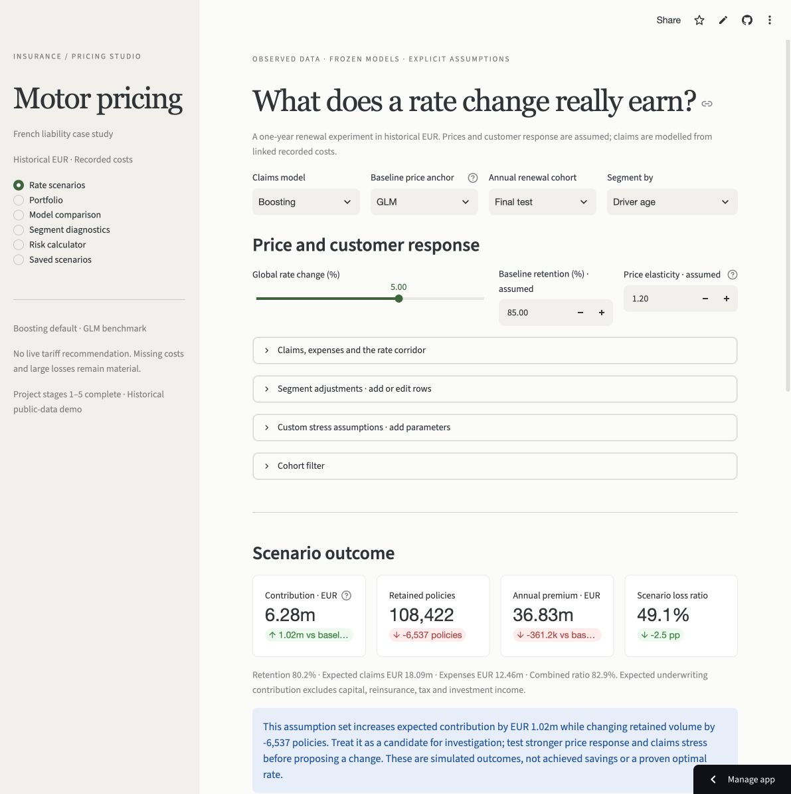
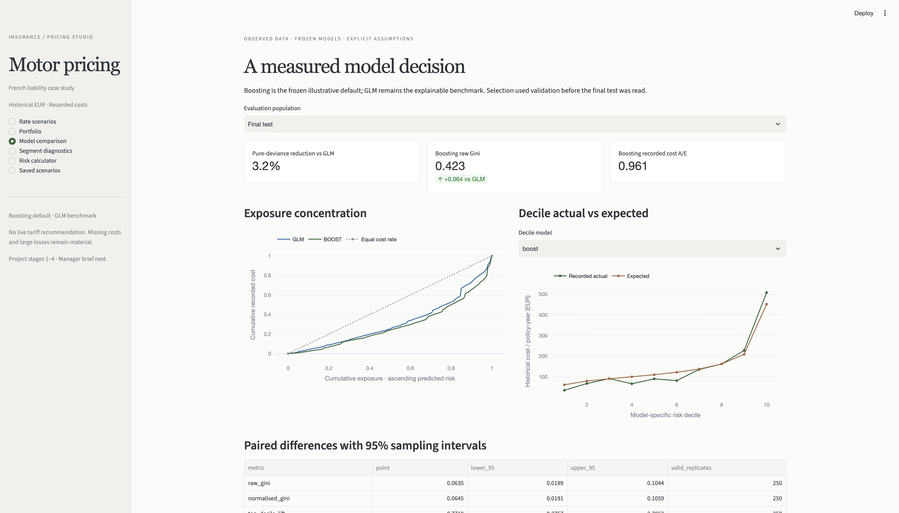

# Motor Insurance Pricing Studio

**Business question:** Can an insurer improve risk differentiation and annual underwriting contribution without losing too much renewal volume?

**Conclusion:** Use boosting for illustrative scenario exploration and retain the Poisson/Gamma GLM as an explainable benchmark. Investigate a bounded +5% rate option with actual premium and renewal evidence before rollout. At assumed elasticity 1.2, the example adds **EUR 1.02m contribution** with **6,537 fewer retained policies**; at elasticity 6, it loses **EUR 0.30m**. These are conditional simulations using synthetic prices, not achieved savings or a recommended live tariff.

All five core parts are complete as a reproducible portfolio case study, with a public aggregate dashboard deployed on 9 October 2026. Production approval and optional Australian context remain outside this delivery.

**[Open the live dashboard](https://insurance-pricing-calculator.streamlit.app/)** — change assumptions and see their effect on contribution, retention and premium.

**Start with the [two-page pricing-manager brief](output/pdf/pricing_manager_brief.pdf), [client handover](docs/CLIENT_HANDOVER.md) or [dashboard guide](docs/DASHBOARD_USAGE.md).**



## Free public hosting

The dashboard is live on **Streamlit Community Cloud** at [insurance-pricing-calculator.streamlit.app](https://insurance-pricing-calculator.streamlit.app/). Public sharing is enabled. Hosted checks covered all six page states, the +5% rate change, claims-model switching at a fixed price anchor, saving a comparison and downloading scenario JSON. See the [hosting guide](docs/HOSTING.md) and [deployment evidence](reports/hosting/deployment.json). Individual risk scoring still needs the full local artefacts. Free apps may sleep after inactivity and can be woken by visitors.

## Run the dashboard locally

For a local dashboard, including individual risk scoring after reconstructing the verified artefacts, clone or download this repository and run these commands from the repository root using Python 3.14:

```bash
python3.14 -m venv .venv
source .venv/bin/activate
python -m pip install -r requirements.lock.txt
python -m pip install --no-deps .
python -m streamlit run app.py --server.address 127.0.0.1 --server.port 8502
```

After Streamlit starts, enter `http://127.0.0.1:8502` in a browser on that same computer. This address only accesses your own running instance; it does not provide access to the author's instance. To review the project without installing it, use the [pricing-manager brief](output/pdf/pricing_manager_brief.pdf) and [dashboard screenshots](reports/dashboard/screenshots/).

Scenario, portfolio, comparison, segment and saved-scenario pages run from committed, checksum-verified aggregate evidence. **Individual risk scoring additionally requires the full verified local pipeline**, including both fitted bundles and both matching prepared data tables. A fresh checkout shows a usable setup message on that page. No fitting or downloads occur when a user changes a parameter.

The six-page Streamlit/Plotly dashboard supports live rate, elasticity, retention, claims-inflation and expense changes; add/edit/remove segment adjustments and response overrides; named frequency/severity/loss stresses; sensitivity curves; model comparison at a fixed price anchor; hypothetical risk inputs and support warnings; and JSON/CSV exports with save/compare/restore/reload. Session saves need a download to persist. Added stress controls are assumptions; a new learned risk variable requires training data and a validated refit.

See the [five-minute manager walkthrough](docs/CLIENT_HANDOVER.md#five-minute-manager-demonstration). [Example scenario JSON/CSV](reports/dashboard/) reproduces the commercial table. [Deployment review](docs/DEPLOYMENT.md) documents the public aggregate deployment and full-calculator artefact requirements.

## Frozen evidence and model choice

On the same final test (135,246 policies, 5,270 linked claims):

| Historical test measure | GLM | Boosting |
|---|---:|---:|
| Pure-premium Tweedie deviance / exposure (lower is better) | 76.353 | 73.877 |
| Raw exposure Gini (higher is better) | 0.359 | 0.423 |
| Normalised Gini | 0.365 | 0.429 |
| Top-decile observed cost-rate / portfolio-rate lift | 2.681 | 3.453 |
| Actual / expected recorded cost (target 1) | 0.886 | 0.961 |
| Expected annual recorded cost, EUR | 165.98 | 153.08 |

Boosting reduces pure-premium deviance by **3.24%**. Paired 250-draw policy-bootstrap intervals support the deviance and Gini improvements: boosting-minus-GLM deviance -2.476 [-5.743, -0.391], raw Gini +0.064 [0.019, 0.104]. Top-decile lift difference +0.772 [-0.376, 2.396] and severity-deviance difference remain uncertain. These fixed-prediction intervals exclude fitting/search, missing costs and drift. Actual test recorded cost is EUR 147.10/year.

GLM uses explicit multiplicative factors and reference bands. Boosting captures nonlinear interactions but needs more explanation and stability review; monotonicity is not imposed. Neither model has established jurisdiction-specific regulatory acceptance or production approval. The dashboard-default choice was frozen on validation before test access. See [model cards](docs/MODEL_CARDS.md), [comparison report](reports/comparison/MODEL_COMPARISON.md) and [GLM diagnostics](reports/glm/GLM_REPORT.md).



## Data, targets and limitations

Public source: **freMTPL2, OpenML version 1**, [frequency 41214](https://www.openml.org/d/41214) and [severity 41215](https://www.openml.org/d/41215). Attribution: C. Dutang and A. Charpentier, CASdatasets (2018); [CASdatasets field documentation](https://dutangc.github.io/CASdatasets/reference/freMTPL.html). CC0 is reported in the saved OpenML metadata. [Source manifest](reports/data_manifest.json) and [source lock](configs/source_lock.json) pin the exact downloaded bytes. No Kaggle credentials are needed. freMTPL2 was chosen over a severity-only competition because linked exposures, counts and costs support the complete workflow.

The pinned snapshot contains 678,013 policies, 26,444 linked positive costs and 358,499.45 policy-years. It differs from the 677,991 policies described for the CASdatasets version; snapshots are not interchangeable. There are 195 orphan severity records and **9,116 policies reporting claims without any linked cost record**. Missing costs are not established zero ultimate losses. The largest 1% of linked claims accounts for approximately 38% of recorded cost. See [data audit](reports/DATA_AUDIT.md) and [data-source rationale](docs/DATA_SOURCES.md).

The main estimand is annual cost represented in the linked severity table: recorded-count frequency times individual recorded-cost severity. Original claim counts remain a separately labelled sensitivity. Source exposure stays uncapped when positive. Historical evaluation weights by exposure; commercial scenarios use one assumed annual renewal per policy.

Prices and response are assumed: baseline GLM price `(annual model loss + EUR 30) / 0.65`, retention 85%, elasticity 1.2, variable expense 25%, margin 10%, no inflation and a combined -20% to +20% rate corridor. The claims model defaults to boosting; switching it holds the chosen price anchor fixed. Inflation/stress affects both cases in the default same-stress comparison. [Commercial evidence](reports/dashboard/COMMERCIAL_REPORT.md) explains the sensitivity and expense basis.

Current premiums, renewal outcomes, customer/time identifiers and developed ultimate claims are absent. Scenario loss ratios use synthetic premiums; contribution excludes capital, reinsurance, tax, investment income, new business and unmodelled anti-selection. The 75+ GLM A/E reverses from about 1.67 on validation to 0.70 on test: segment ratios warrant investigation, not automatic rate changes. Historical French liability EUR results do not establish current Australian motor or home prices.

## Reproduce the analysis

After installing the environment above:

```bash
insurance-pricing prepare
insurance-pricing train-glm
insurance-pricing train-boost
insurance-pricing evaluate
insurance-pricing prepare-dashboard
python -m pytest -q
```

Preparation downloads about 7.75 MB once and verifies source SHA-256 hashes. Policy-ID hashing with seed 20261008 assigns approximately 60/20/20 splits; claims inherit policy splits. Feature/category fitting uses train only. GLM annual-rate frequency uses exposure weights (equivalent to a count/log-exposure-offset likelihood); Gamma severity uses individual positive claims with unit weights. Annual predictions multiply into pure premium. Boosting uses Poisson/Gamma components, native categories and continuous risk inputs with three predeclared validation candidates per component.

Selection is frozen before final evaluation; main costs remain uncapped and there is no post-test calibration/refit. **Do not retune on the now-published test.** Replacing risk variables or selection needs a new untouched evaluation population. Existing local bundles allow evaluation without refitting, subject to config/code/data/runtime hashes. Other runtime versions need a consistent rebuild of earlier stages rather than unchecked binary reuse.

Raw/prepared records, row-level predictions and model binaries under `data/` and `artifacts/` are Git-ignored. Aggregate evidence is committed. After package-source edits reinstall using `python -m pip install --no-deps .`, or use `PYTHONPATH=src .venv/bin/python -m insurance_pricing.cli <command>`. Restart Streamlit after imported-module edits. The verified setup uses a regular install because a macOS hidden `.pth` issue affected editable installs.

Detailed feature engineering, exposure treatment, validation, diagnostics and sensitivity contracts are in [METHODOLOGY.md](docs/METHODOLOGY.md). Rebuild comparison figures using `PYTHONPATH=src python figures/gen_fig_comparison.py`; GLM figures use `figures/gen_fig_glm.py`.

## Verify and package the handover

```bash
python -m pip install -r requirements-report.txt
python scripts/build_manager_brief.py
PYTHONPATH=src python scripts/verify_handover.py
PYTHONPATH=src python scripts/package_client.py
```

Part 5 verifies the two-page PDF, source/value/link hashes, all five recomputed examples, a clean aggregate-only app tree, all six page states and a live +5% edit. The local ZIP under `dist/` has an allowlist and per-file integrity manifest; it excludes policy records and fitted binaries. Optional PDF tools do not change the main application lock.

Local application evidence: **72 tests pass**, independent full 135,246-policy scenario reconciliation at relative tolerance 1e-12, unchanged model/selection hashes, verified browser JSON reload and a measured warm KPI update of 0.36 seconds. Warm timings are local observations, not hosting guarantees. [Part 4 verification](reports/dashboard/verification.json), [Part 5 verification](reports/handover/verification.json) and [handover review](reports/handover/review.json) distinguish automated checks from visual review. [GitHub Actions](https://github.com/TanmaySomani/Insurance-pricing-calculator/actions) provides commit-specific remote evidence; a workflow definition alone is not a passed run.

## Change history

The five implementation commits below describe how the repository developed, with the latest changes first. The current application version is **0.4.0** (`pyproject.toml`).

### Part 5 — Pricing brief and client handover

Commit: [`ddfdab4`](https://github.com/TanmaySomani/Insurance-pricing-calculator/commit/ddfdab4ac84dd4a51dba37f3742536428a026621)

- Added the two-page pricing-manager PDF, rendered previews, a reproducible report builder and a source/value integrity manifest.
- Added the client handover, five-minute demonstration, model cards and deployment guidance; revised the README around business results, setup and limitations.
- Added handover verification and allowlisted client ZIP packaging. Extended CI to rebuild/check the PDF, verify the aggregate-only handover and create the package. Remote CI success is not established by these workflow changes.

### Part 4 — Live dashboard and commercial scenario engine

Commit: [`ab39762`](https://github.com/TanmaySomani/Insurance-pricing-calculator/commit/ab39762)

- Added an annual-renewal scenario engine for premiums, retention, claims, expenses and underwriting contribution, with segment adjustments, response overrides and claims stresses.
- Added six Streamlit/Plotly pages: Rate scenarios, Portfolio, Model comparison, Segment diagnostics, Risk calculator and Saved scenarios. Added live controls, sensitivity curves, fixed-price-anchor model comparisons and JSON/CSV export/reload.
- Added checksum-verified aggregate dashboard inputs, five example scenarios, screenshots, usage documentation and scenario/dashboard tests. Individual risk scoring requires locally rebuilt model bundles and matching prepared data.

### Part 3 — Boosting challenger and frozen model comparison

Commit: [`05856cd`](https://github.com/TanmaySomani/Insurance-pricing-calculator/commit/05856cd)

- Added Poisson/Gamma histogram gradient boosting with a predeclared validation-only candidate search and model selection frozen before final test evaluation.
- Added common-population GLM/boosting comparisons using deviance, exposure-weighted Gini, lift, deciles and segment calibration, with paired policy-bootstrap uncertainty and tail/missing-cost sensitivities.
- Added explanation diagnostics, hypothetical risk profiles, comparison figures, integrity metadata and tests. Selected boosting for illustrative dashboard scenarios while retaining the GLM benchmark.

### Part 2 — Exposure-aware GLM pricing baseline

Commit: [`ca26bfc`](https://github.com/TanmaySomani/Insurance-pricing-calculator/commit/ca26bfc)

- Added exposure-aware Poisson frequency and individual-claim Gamma severity GLMs, annual pure-premium predictions and intercept-only benchmarks.
- Added training-only preprocessing, fitted model metadata, coefficient relativities, calibration/segment/decile reports, residual and influence diagnostics, and claim-count/large-loss sensitivities.
- Added the `train-glm` command, GLM report and figures, modelling dependencies and model tests.

### Part 1 — Audited data foundation

Commit: [`db0f098`](https://github.com/TanmaySomani/Insurance-pricing-calculator/commit/db0f098)

- Established the Python package and CLI, pinned dependencies, CI workflow, project documentation and MIT license.
- Added checksum-pinned OpenML downloads, policy/claim linkage audits, claim-count reconciliation, exposure handling, engineered features and deterministic policy-level train/validation/test splits.
- Added source manifests, aggregate audit reports and data tests. Excluded raw/prepared records and model binaries from Git.

## Delivery checkpoints

| Part | Deliverable | Status |
|---|---|---|
| 1 | Public source, provenance, audit, features and fixed splits | Complete |
| 2 | Poisson/Gamma GLMs, pure premium and diagnostics | Complete |
| 3 | Boosting, lift/Gini/deciles, uncertainty and frozen comparison | Complete |
| 4 | Annual-renewal simulation and live editable dashboard | Complete |
| 5 | Two-page brief, client handover, model cards and packaging review | Complete |
| Optional | Separately sourced Australian public-data context | Not started |

[CHECKPOINT.md](CHECKPOINT.md) preserves decisions, commands and continuation boundaries. The core case study is delivered for review and demonstration. Real repricing requires developed claims, actual premiums and renewals, credible expenses, customer/time validation and applicable governance review.
