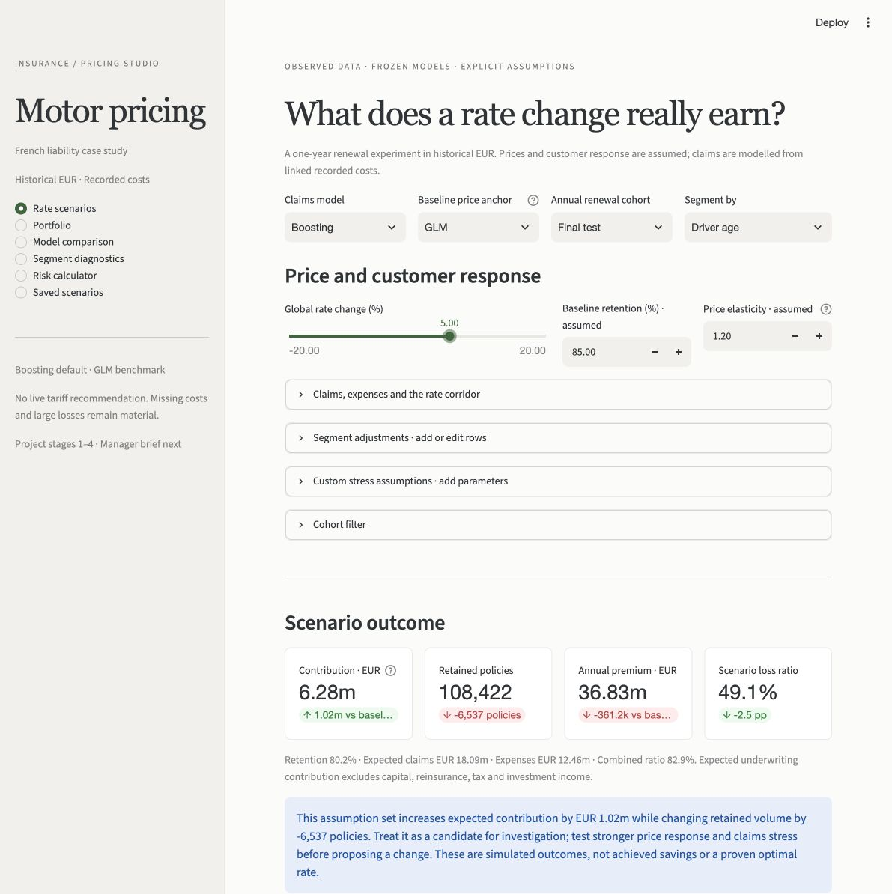
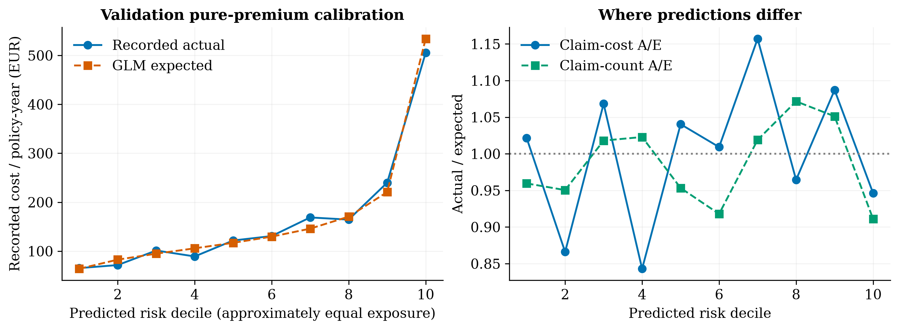
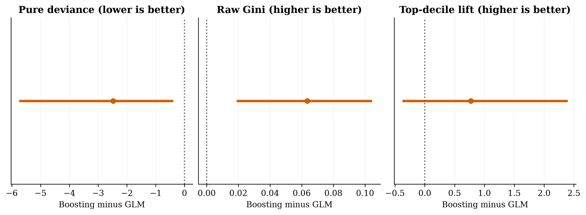

# Motor Insurance Pricing Calculator

**Business question:** How should a motor insurer differentiate prices by risk while balancing expected claims, retention, and underwriting contribution?

**Current conclusion:** Use boosting as the default for the illustrative dashboard and retain the Poisson/Gamma GLM as an explainable benchmark. On the frozen final test, boosting reduces recorded pure-premium deviance by 3.2% and raises raw exposure Gini from 0.359 to 0.423. Paired sampling intervals support those gains; top-decile lift improvement remains uncertain. Missing claim costs and large-loss uncertainty prevent a live tariff recommendation.

This is a staged portfolio case study using French motor third-party liability data. Data, GLMs and the boosting comparison are implemented. The live commercial dashboard is implemented. The final two-page manager brief and client handover are next.

## Delivery checkpoints

| Part | Deliverable | Status |
|---|---|---|
| 1 | Public data, provenance, quality audit, engineered features, frozen splits | Complete |
| 2 | Poisson frequency + Gamma severity GLMs, pure premium, diagnostics | Complete |
| 3 | Gradient boosting, lift/Gini/decile validation, model recommendation | Complete |
| 4 | Commercial simulation and live dashboard with editable assumptions | Complete |
| 5 | Client presentation, two-page summary, deployment and final review | Next |
| Optional | Australian market risk context with separately sourced public data | After core delivery |

Resume instructions are in [CHECKPOINT.md](CHECKPOINT.md). Each part will finish with updated commands, tests, findings, and the next task. A checkpoint is a deliberate handover point, not a claim that the whole project is finished.

## Why this dataset

The primary source is **freMTPL2, OpenML version 1**:

- [41214 — frequency](https://www.openml.org/d/41214): policy risk characteristics, exposure and original claim counts.
- [41215 — severity](https://www.openml.org/d/41215): claim amounts linked through `IDpol`.
- [CASdatasets documentation](https://dutangc.github.io/CASdatasets/reference/freMTPL.html): provenance and field definitions.

OpenML reports CC0 for both dataset snapshots. Attribution and download checksums are recorded in [data_manifest.json](reports/data_manifest.json). The OpenML snapshot contains **678,013 policies**, whereas the CASdatasets description refers to 677,991; this project pins the downloaded OpenML bytes rather than treating different versions as interchangeable.

The [Allstate Kaggle competition](https://www.kaggle.com/competitions/allstate-claims-severity/data) is a useful severity alternative. We choose freMTPL2 because its linked policy exposure, counts, and costs support the full requested pricing workflow. See [DATA_SOURCES.md](docs/DATA_SOURCES.md).

## What Part 1 found

| Measure | Value |
|---|---:|
| Raw policy rows | 678,013 |
| Raw claim-cost records | 26,639 |
| Matched claim-cost records | 26,444 |
| Exposure | 358,499.45 policy-years |
| Original claim count | 36,102 |
| Policies reporting claims without any cost record | 9,116 |
| Orphan claim records excluded from modelling | 195 |
| Recorded cost per policy-year | EUR 167.11 |

These describe the snapshot; EUR 167.11 is **not a fitted premium or a recommended rate**. No currency conversion, inflation, loss development, expenses, or profit allowance is included. The largest 1% of matched claims account for approximately 38% of recorded cost, so tail uncertainty will matter in model comparison.

The main estimand is **expected cost represented in the linked claim-cost table**. Frequency uses its count of recorded claims; severity uses positive individual claim costs. Original `ClaimNb` remains available for a separately labelled sensitivity. Missing costs are flagged, never presented as evidence of zero ultimate loss. Full detail: [data audit](reports/DATA_AUDIT.md) and [methodology](docs/METHODOLOGY.md).

## Reproduce Part 1

Use Python 3.14 for the verified environment. The package allows Python 3.12–3.14; other environments still need validation. Run from the repository root:

```bash
python3.14 -m venv .venv
source .venv/bin/activate
python -m pip install -r requirements.lock.txt
python -m pip install --no-deps .
insurance-pricing prepare
python -m pytest -q
```

The first prepare downloads about 7.75 MB from OpenML using HTTPS, with no Kaggle credentials. Later runs verify the cached bytes against the committed SHA-256 source lock. Structural data defects halt preparation. If a cache is corrupted, remove the affected local raw file and rerun; do not casually update the source lock.

`insurance-pricing download` downloads and verifies sources without preparation. To run elsewhere, pass `--root /absolute/path/to/repository`. After editing package code, reinstall with `python -m pip install --no-deps .`, or run directly from source with `PYTHONPATH=src .venv/bin/python -m insurance_pricing.cli prepare`.

The setup uses a regular package install. Editable installs can fail in macOS environments that mark `.pth` files hidden, because Python skips those files; this [CPython issue](https://github.com/python/cpython/issues/148121) occurred locally. A regular install or the direct-source command above avoids relying on an editable `.pth` file.

Outputs:

- `data/processed/policies.parquet`: one row per policy, raw risk factors, features, both target definitions, flags, partition.
- `data/processed/claims.parquet`: one row per matched claim, risk factors, features, inherited partition.
- [reports/](reports/): provenance, audit, reconciliation and descriptive segment summary. Raw/processed records are excluded from Git; reproducible code and aggregate reports are committed.

## Live interactive dashboard — Part 4

The Streamlit/Plotly dashboard provides portfolio/model results, segment diagnostics, an individual risk calculator and commercial scenarios. Assumption edits recalculate expected retention, retained policies, premium, claims, scenario loss ratio and underwriting contribution. Add/edit/remove segment adjustments and response overrides; add named stress parameters; save, compare, download and reload scenarios.

```bash
source .venv/bin/activate
python -m streamlit run app.py --server.address 127.0.0.1 --server.port 8502
```

Open [localhost:8502](http://127.0.0.1:8502). The scenario and diagnostic pages work from verified aggregate evidence committed to GitHub. The risk calculator additionally needs the local fitted bundles. After the modelling pipeline, run `insurance-pricing prepare-dashboard` to rebuild/version the aggregates without refitting. See [DASHBOARD_USAGE.md](docs/DASHBOARD_USAGE.md) for setup, inputs, row editing, scenario persistence and limits.

The +5% illustrative scenario, at assumed elasticity 1.2, increases contribution by about **EUR 1.02m** while losing about **6,537 retained policies**. At elasticity 6 the contribution change is **−EUR 0.30m**. The recommendation is to investigate a bounded move and measure renewal response before rollout; these are simulated results at synthetic premiums, not achieved savings. Full assumptions and sensitivity are in [COMMERCIAL_REPORT.md](reports/dashboard/COMMERCIAL_REPORT.md).



Inputs include rate change, baseline retention, elasticity, claims inflation, expense ratio, fixed expense and margin. Claims model choice switches between GLM and boosting while the selected baseline price anchor stays fixed for fair comparison. New rating variables will require available training data and a validated model refit; adding a dashboard control alone cannot create a learned risk effect. See [DASHBOARD_SPEC.md](docs/DASHBOARD_SPEC.md).

## Part 2: interpretable pricing baseline

Run after preparing data, using the installed package or directly from source:

```bash
insurance-pricing train-glm
# Development alternative after editing source:
PYTHONPATH=src .venv/bin/python -m insurance_pricing.cli train-glm
```

The main models are unpenalised log-link Poisson/Gamma GLMs with 58 parameters each, including intercept. Frequency uses annual claim rates with exposure weights; severity uses individual positive claims with unit weights. Train-only category encoding has explicit references and rejects unseen categories. Part 2 fitted and evaluated train/validation only; the frozen final test comparison was added in Part 3.

| Validation measure | Intercept | GLM |
|---|---:|---:|
| Frequency Poisson deviance / exposure | 0.4743 | 0.4548 |
| Severity Gamma deviance / claim | 1.7756 | 1.7445 |
| Pure-premium Tweedie p=1.5 deviance / exposure | 87.0471 | 81.2033 |
| Recorded pure-premium actual / expected | 0.9527 | 0.9961 |

The main pure-premium A/E has a fixed-prediction policy-bootstrap 95% interval of **0.806–1.233**. This covers validation sampling variability only. The illustrative original-count estimate is EUR 229.66/year; the training-p99-capped severity sensitivity is EUR 117.65/year. Neither replaces the uncapped main recorded-cost estimate. Good aggregate calibration also hides material age/region differences.

See [GLM_REPORT.md](reports/glm/GLM_REPORT.md) for deciles, segment coverage, coefficients, residuals, influence diagnostics, sensitivities and business interpretation.



Training saves the reusable model bundle, policy/claim predictions, and row-level residuals under local `artifacts/glm/`. Prediction columns use the `pred_` prefix to preserve all observed fields. Source/config/code/processed-data hashes, package versions and convergence details are in [training_metadata.json](reports/glm/training_metadata.json). Aggregate reports and PNG/vector PDF charts are committed. Regenerate figures with `PYTHONPATH=src .venv/bin/python figures/gen_fig_glm.py`.

Part 2 was verified by full training on the real snapshot and **32 passing tests**, including an independent count/offset likelihood comparison, score-equation checks, model serialization, holdout leakage guards and prediction export integrity. Part 3 adds Gini, model-comparison lift uncertainty and final test results below.

## Part 3: boosting comparison and frozen final test

From a fresh checkout, run the stages in order after setup:

```bash
insurance-pricing prepare
insurance-pricing train-glm
insurance-pricing train-boost
insurance-pricing evaluate
python -m pytest -q
```

Once bundles exist, `insurance-pricing evaluate` verifies their selection/data/config/code/version checksums before scoring and can regenerate evidence without refitting. Do not change the search after inspecting the published test results. Rebuilding in a different runtime requires rebuilding the earlier stages; local bundles are not distributed or guaranteed portable across library versions.

Histogram boosting uses Poisson frequency loss with exposure weights and Gamma severity loss on individual claims. A predeclared three-candidate search for each component selects on validation only. Continuous age/power/bonus features complement native categorical area/brand/fuel/region handling. No outcome or exposure is a rating predictor; no calibration multiplier is applied. The illustrative dashboard-default decision is saved before test access in [selection.json](reports/comparison/selection.json).

| Final-test measure | GLM | Boosting |
|---|---:|---:|
| Pure-premium Tweedie p=1.5 deviance / exposure | 76.353 | 73.877 |
| Raw exposure concentration Gini | 0.359 | 0.423 |
| Normalised Gini | 0.365 | 0.429 |
| Top-decile observed cost / portfolio cost rate | 2.681 | 3.453 |
| Recorded cost actual / expected | 0.886 | 0.961 |
| Expected recorded cost / policy-year, EUR | 165.98 | 153.08 |

Actual final-test recorded cost is EUR 147.10/year on 135,246 policies and 5,270 linked claims. Paired 250-replicate policy-bootstrap intervals give boosting-minus-GLM pure deviance **−2.476 [−5.743, −0.391]**, raw Gini **+0.064 [0.019, 0.104]**, and top-decile lift **+0.772 [−0.376, 2.396]**. Predictions and bins stay fixed; intervals exclude parameter/tuning uncertainty, missing costs and drift. Higher A/E alone is not a quality gain; closeness to one matters.

The model recommendation is bounded: proceed with boosting for commercial scenario exploration and keep GLM available. Investigate segment differences before repricing. The GLM's 75+ A/E changes from about 1.67 on validation to 0.70 on test, showing why an isolated segment ratio is a poor rate-change rule. The 55–64 group remains below one in both holdouts, but a real rate decrease requires current premium and retention evidence.

See [MODEL_COMPARISON.md](reports/comparison/MODEL_COMPARISON.md) for the tuning search, paired uncertainty, decile/segment intervals, capped-outcome and largest-policy sensitivities, model response examples, interpretability and governance trade-offs.



Part 3 saves reusable boosting models under local `artifacts/boost/` and holdout predictions under `artifacts/comparison/`. Aggregate reports and five PNG/vector PDF figure pairs are committed. Regenerate figures with `PYTHONPATH=src .venv/bin/python figures/gen_fig_comparison.py`. Package version 0.3.0 is verified with **45 passing local tests**, including independent exposure-weighted Gini arithmetic, paired identical-model bootstrap checks, correct Poisson exposure weights, holdout rejection and checksum-tampering detection. Repeated frozen evaluation reproduces numerical CSV evidence and leaves both model bundles and the selection record unchanged. Remote GitHub CI status must be verified separately.

Part 4 package version 0.4.0 is verified with **72 passing local tests**, exact aggregate versus independent policy-level scenario reconciliation, live JSON upload/reload, and a warm browser KPI update of **0.36 seconds** on the documented local machine. The full warm Python-side rerun p95 was about 0.14 seconds. No model was refitted or selected again. Public hosting and the final manager PDF belong to Part 5.

## Judgement and limitations

- Historical French liability costs are not current Australian motor or home prices.
- Random policy holdouts cannot measure future performance; dates and customer identifiers are absent.
- Recorded-cost incompleteness may vary by segment. This uncertainty is central to interpretation.
- Baseline premiums and elasticity will be explicit assumptions because historical premiums and renewal outcomes are unavailable.
- An interpretable GLM helps explain rating factors; neither GLMs nor boosting have automatic regulatory approval. Governance, permitted variables, fairness, stability, and documentation must be assessed for the deployment jurisdiction.
- Business recommendations follow model evidence and commercial sensitivity, with actual premium and renewal evidence required before repricing.

## Project structure

```text
configs/                 Source checksum lock and data/split decisions
src/insurance_pricing/   Reusable download, preparation and feature code
tests/                   Financial integrity and leakage safeguards
data/raw/                Local verified source cache (not committed)
data/processed/          Reproducible policy and claim tables (not committed)
reports/                 Committed aggregate audit evidence
docs/                    Sources, methodology, dashboard and roadmap
artifacts/               Local model, prediction and residual artifacts (not committed)
figures/                 Figure regeneration scripts
```

Code is MIT licensed; source-data licensing is separately reported by OpenML. GLM/boosting holdout evidence and clearly labelled commercial simulations are available; no achieved savings or Australian pricing conclusions are claimed.
