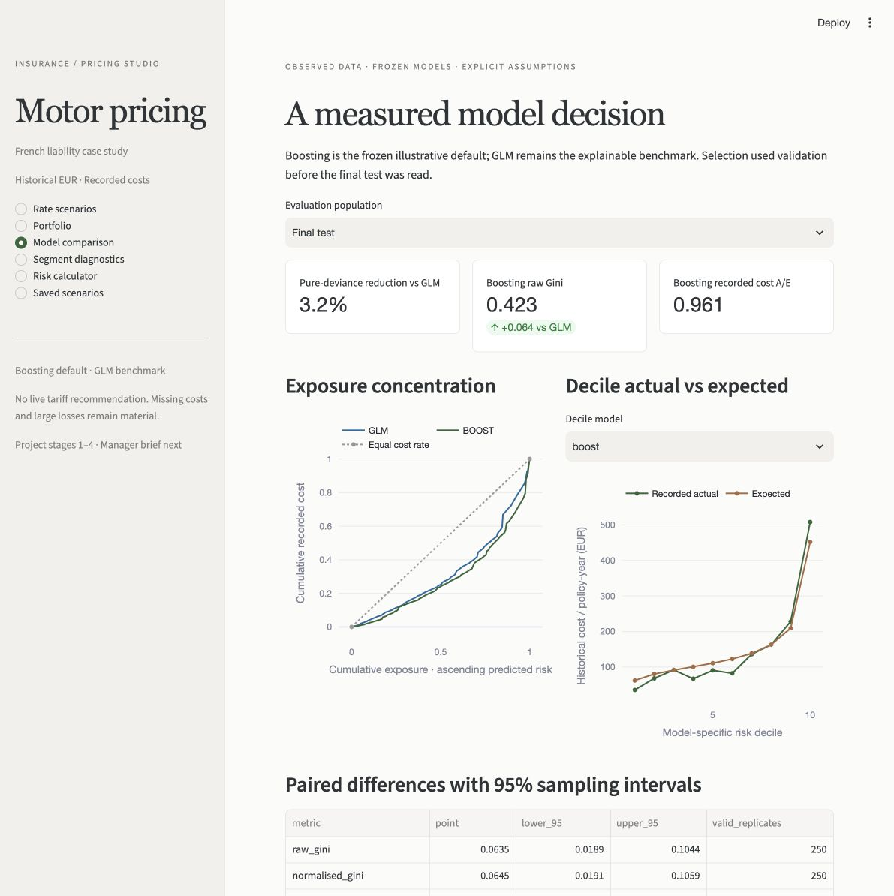

# Pricing studio — Part 4

**Business question:** Does a rate move improve expected underwriting contribution enough to justify its effect on retained volume?

**Recommendation:** Investigate a modest, bounded change with current premium and renewal evidence. The illustrative +5% scenario improves contribution under elasticity 1.2 but reduces it under elasticity 6. Do not approve a blanket increase from the simulation. Keep GLM and boosting available and compare them at the same baseline price anchor.

## Open the dashboard

From the repository root after creating the documented Python environment:

```bash
source .venv/bin/activate
python -m pip install -r requirements.lock.txt
python -m pip install --no-deps .
python -m streamlit run app.py --server.address 127.0.0.1 --server.port 8502
```

After running the commands above on your own computer, enter `http://127.0.0.1:8502` in a browser on that same computer. The address accesses only your own running dashboard. The [public aggregate dashboard](https://insurance-pricing-calculator.streamlit.app/) is also available without local installation. Individual risk scoring requires the full local setup. See [hosting details](HOSTING.md).

The committed, verified aggregate inputs let the scenario and diagnostic pages run directly from a fresh checkout. The individual risk calculator additionally needs the local fitted bundles. Rebuild all stages when needed:

```bash
insurance-pricing prepare
insurance-pricing train-glm
insurance-pricing train-boost
insurance-pricing evaluate
insurance-pricing prepare-dashboard
```

These reproduce the declared pipeline; do not revise the search using published test results. `prepare-dashboard` checks the frozen models, scores the policy snapshot without fitting, and builds aggregates. If source/model/comparison inputs or the engine change, rebuild/version the dashboard inputs. After editing package code, reinstall or use the `PYTHONPATH=src` development commands. Restart the Streamlit server after editing modules under `src/` to ensure the imported code is refreshed.

## A manager's walkthrough

1. Open **Rate scenarios**. Default cohort is the 135,246 final-test policies, each represented as one assumed annual renewal opportunity. Full-snapshot, training and validation cohorts are also available. Historical exposure is not a renewal weight.
2. Keep **Baseline price anchor = GLM** while switching the claims model. This holds synthetic baseline premiums fixed; only expected claims and contribution change. Changing the anchor explicitly rebuilds the assumed baseline prices.
3. Set the global rate move, baseline retention and price elasticity. Defaults are assumptions: 85% retention, elasticity 1.2, no claims inflation, 25% variable expense, EUR 30 fixed expense per retained policy and 10% baseline price margin. Combined rate corridor defaults to −20% through +20%.
4. Expand **Segment adjustments**. Use **Add segment** or the editor's new-row control. Enter an extra rate change and optional elasticity/retention overrides. Global and segment adjustments multiply. Blank overrides inherit global values. Delete a row through its row-selection control. Duplicate/unknown levels and corridor breaches are rejected. Changing segmentation clears the rules and filter with a notice.
5. Expand **Custom stress assumptions** and add named frequency, severity or total-loss multipliers. Their product stresses claims in both the changed-price and default baseline cases. This adds commercial assumptions; it does not create a learned rating feature. New fitted predictors require training data, transformation and validation.
6. Review contribution, retained policies, premium, claims, expenses and scenario loss ratio. Compare the sensitivity curve and segment volumes/coverage. A curve maximum is conditional on the entered assumptions, not a proven optimal tariff. Optionally compare with an explicitly labelled unstressed baseline; that difference includes claims stress as well as rates.
7. Name the scenario and **Save to comparison**. Saved scenarios live in the current browser session; saving the same name replaces that session entry. Download JSON for durable storage, and CSV for segment results. **Saved scenarios** lets you compare, restore, remove and reload JSON. Compare like-for-like cohorts/anchors when isolating an effect.
8. Use **Portfolio**, **Model comparison** and **Segment diagnostics** for observed historical evidence. The **Risk calculator** uses supported training categories/ranges, both frozen models and the current valid working scenario. It shows coarse training support and warns about thin cells and extreme inputs. A hypothetical risk is evaluated independently of the portfolio filter.

## What the numbers mean

Prices are synthetic: `(anchor annual recorded loss + fixed expense) / (1 − variable expense − margin)`. Retention is an assumed price response, bounded at 100%. Inflation and named stress factors act on modelled linked-record loss costs. Expense totals scale with retained policies; fixed expense here means an annual cost per retained policy, not a book-level fixed overhead.

Expected underwriting contribution is premium minus modelled claims and specified expenses. It excludes capital, reinsurance, tax, investment income, new business and unmodelled anti-selection. Loss ratio is a **scenario loss ratio**, not an observed historical premium-based ratio. No premiums or renewal outcomes exist in this source, so neither baseline prices nor elasticity were fitted from it.

The entire source is historical French motor liability in EUR. Missing claim costs, loss development, inflation to current rates, future drift and Australian risk transfer remain unresolved. A/E diagnostics and the commercial forecast use different horizons: historical exposure versus one assumed annual renewal per policy.

## Reproducibility, validation and response time

`reports/dashboard/manifest.json` binds the aggregate inputs, risk specification and comparison evidence to the frozen selection and engine checksum. Scenario JSON carries this fingerprint and an engine/schema version. Unsupported versions/fields, non-finite values and duplicate JSON keys are rejected. Uploaded outputs are never trusted: the app recomputes from checked inputs. Imports cannot contain executable models or arbitrary rating functions. The risk calculator only loads local model bundles after checksum/runtime checks; no uploaded pickle is accepted.

The renewal engine uses exact aggregates for one selected field. Within a segment, shared response/stress factors and an affine price formula allow sums of policy weights and annual model losses to reproduce individual-policy calculations. It does not approximate with a sample or use average loss ratios. Cross-field overlapping rules are outside the current contract.

Verification includes 72 passing local tests, an independent full 135,246-policy reconciliation to tolerance 1e-12, segment/filter identities, model-switch price invariance, added/edited rows, saved restoration, zero-change/zero-elasticity behaviour and invalid-input states. The browser additionally verified JSON upload/reload and a visible rate-result update. Numerical bundles and the Part 3 selection hash remained unchanged.

On CPython 3.14.7 / macOS arm64, six warm Python-side app reruns had p95 about 0.14 seconds. A warm slider edit reached a visible KPI in 0.36 seconds, including UI automation overhead. These are local measurements, not cold-start, network or hosting guarantees. Detailed timings are in `reports/dashboard/verification.json`. [Streamlit's caching APIs](https://docs.streamlit.io/develop/concepts/architecture/caching) cache evidence and frozen models; [the dynamic data editor](https://docs.streamlit.io/develop/api-reference/data/st.data_editor) supports add/delete rows.

Run checks:

```bash
python -m pytest -q
PYTHONPATH=src .venv/bin/python scripts/verify_dashboard.py
```

The verification script needs the local fitted bundles and Part 3 policy exports. It regenerates example JSON/CSV and Python timing evidence; it does not fit models. Its browser timing records the separately observed manual verification, not a browser benchmark run by that script. Remote GitHub CI success must be checked separately.



