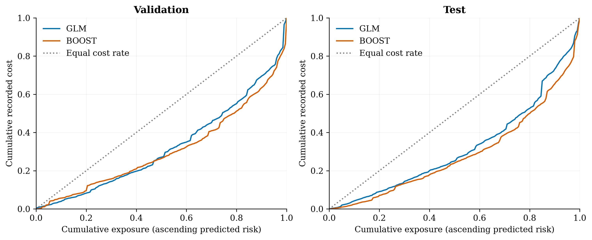
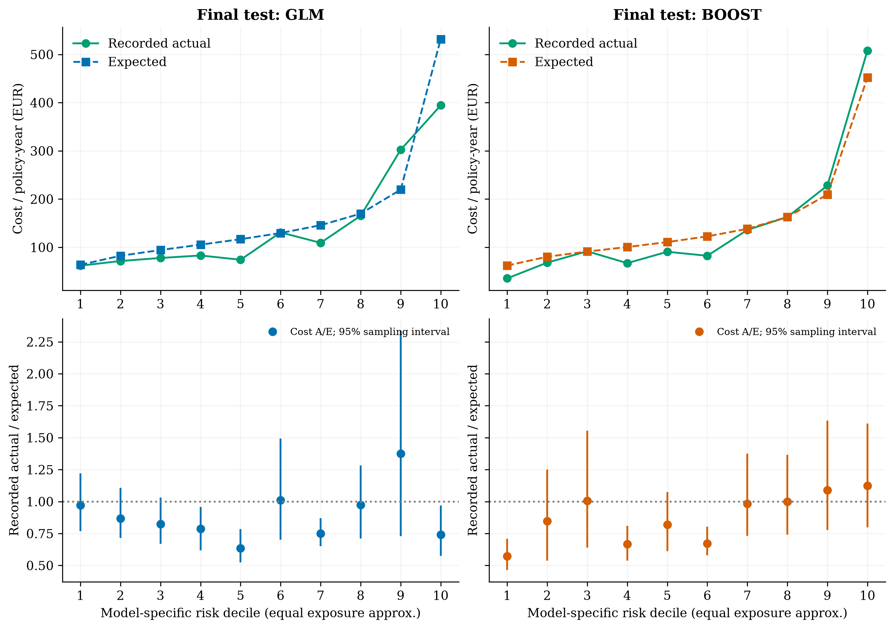
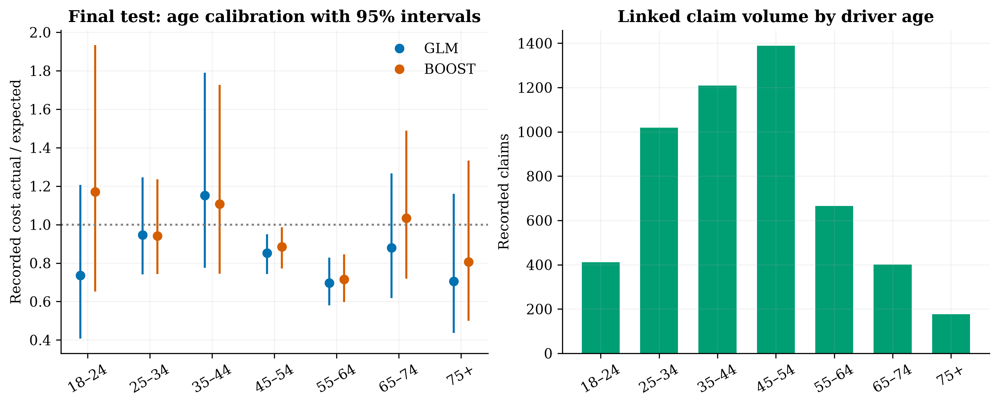
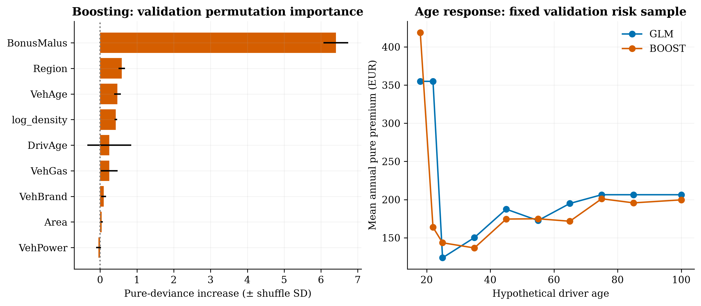

# Model comparison — Part 3

**Business question:** Does a more flexible pricing model improve risk differentiation enough to justify its additional explanation and monitoring effort?

**Decision:** Use **BOOST as the default for the illustrative commercial dashboard**, with GLM available for comparison. This decision was frozen on validation before test access. On the final test, boosting reduces recorded pure-premium deviance by **3.2%** versus GLM. The paired sampling interval supports a reduction. Keep GLM as the explainable benchmark. Investigate segment and large-loss behaviour before considering real repricing; these data do not support a live tariff recommendation.

The output predicts costs represented in the linked claim table, in historical EUR per policy-year. Missing claim costs, future loss development, inflation, expenses, renewal behaviour and current premiums are outside the fitted target. Neither model predicts an ultimate technical premium.

## Evidence on identical holdouts

| Population / metric | Intercept | GLM | Boosting |
|---|---:|---:|---:|
| Validation: Poisson deviance / exposure | 0.4743 | 0.4548 | 0.4462 |
| Validation: Gamma deviance / claim | 1.7756 | 1.7445 | 1.6405 |
| Validation: Tweedie p=1.5 deviance / exposure | 87.0471 | 81.2033 | 78.8975 |
| Validation: Recorded cost actual / expected | 0.9527 | 0.9961 | 1.0807 |
| Validation: Expected recorded cost / year, EUR | 174.1534 | 166.5646 | 153.5266 |
| Validation: Raw exposure concentration Gini | 0.0000 | 0.3528 | 0.3823 |
| Validation: Normalised Gini | 0.0000 | 0.3578 | 0.3877 |
| Validation: Highest-decile observed cost / portfolio cost rate | — | 3.0459 | 3.6608 |
| Final test: Poisson deviance / exposure | 0.4827 | 0.4611 | 0.4484 |
| Final test: Gamma deviance / claim | 1.5327 | 1.5617 | 1.4998 |
| Final test: Tweedie p=1.5 deviance / exposure | 81.4756 | 76.3533 | 73.8771 |
| Final test: Recorded cost actual / expected | 0.8447 | 0.8863 | 0.9610 |
| Final test: Expected recorded cost / year, EUR | 174.1534 | 165.9816 | 153.0767 |
| Final test: Raw exposure concentration Gini | 0.0000 | 0.3590 | 0.4225 |
| Final test: Normalised Gini | 0.0000 | 0.3647 | 0.4292 |
| Final test: Highest-decile observed cost / portfolio cost rate | — | 2.6814 | 3.4533 |

Validation recorded cost is EUR 165.91/year; final test recorded cost is EUR 147.10/year. Test contains 135,246 policies and 5,270 linked claims. Lower deviance is better; higher Gini/lift is better. An intercept has tied scores and no highest-decile lift.

| Final-test metric: point [95% sampling interval] | GLM | Boosting | Boosting minus GLM |
|---|---:|---:|---:|
| pure_deviance | 76.353 [70.686, 85.488] | 73.877 [68.745, 80.407] | -2.476 [-5.743, -0.391] |
| raw_gini | 0.359 [0.295, 0.431] | 0.423 [0.349, 0.523] | 0.064 [0.019, 0.104] |
| normalised_gini | 0.365 [0.301, 0.436] | 0.429 [0.354, 0.529] | 0.065 [0.019, 0.106] |
| top_decile_lift | 2.681 [2.082, 3.340] | 3.453 [2.584, 4.617] | 0.772 [-0.376, 2.396] |
| pure_premium_AE | 0.886 [0.752, 1.096] | 0.961 [0.820, 1.188] | 0.075 [0.063, 0.092] |

Intervals use 250 paired, fixed-size policy bootstrap samples. Both models receive the same sampled policies; repeated claims remain with their policy. Predictions, sort orders and decile membership stay fixed. These are conditional sampling intervals, not refitting/tuning intervals, and do not cover missing costs, future drift or unidentified repeated customers. Validation intervals follow a tuning search and do not remove selection optimism. Percentile intervals are approximate for this heavy-tailed portfolio; Gini and lift gains need not have the same evidential strength as deviance gains.

The final-test pure-deviance and raw-Gini differences have intervals on the favourable side of zero. The top-decile lift difference and severity-deviance difference include zero, so their point improvements are not established by these intervals. Higher A/E is not intrinsically better: calibration depends on distance from one.

## Calibration and segment judgement

Final-test aggregate A/E is 0.886 for GLM and 0.961 for boosting. A/E above one means recorded costs exceed expected costs. No calibration multiplier was applied to either model; aggregate balance must not be inferred from the separate component fits.

Deciles rank annual pure premium and allocate approximately equal exposure using tied-score group midpoints. Equal scores are never split, so exposure shares can differ and bins can be absent. Each model has its own deciles: same-numbered deciles are not the same policies. Actual/expected uses exposure times annual prediction in the denominator. CSVs retain policy counts, claim counts and exposure; sparse-segment flags use <100 recorded claims as a screen, not formal credibility.

| Final-test driver age | Claims | GLM cost A/E [95%] | Boost cost A/E [95%] |
|---|---:|---:|---:|
| 18–24 | 411 | 0.736 [0.407, 1.206] | 1.170 [0.653, 1.934] |
| 25–34 | 1,019 | 0.946 [0.741, 1.246] | 0.942 [0.743, 1.236] |
| 35–44 | 1,209 | 1.152 [0.776, 1.790] | 1.107 [0.744, 1.726] |
| 45–54 | 1,389 | 0.852 [0.743, 0.950] | 0.885 [0.772, 0.986] |
| 55–64 | 665 | 0.697 [0.580, 0.829] | 0.715 [0.597, 0.845] |
| 65–74 | 401 | 0.879 [0.619, 1.266] | 1.034 [0.719, 1.488] |
| 75+ | 176 | 0.704 [0.437, 1.161] | 0.807 [0.500, 1.332] |

Review age, region, bonus/malus and cost-table coverage together. A ratio above one is an investigation signal, not an automatic rate increase: large claims, incomplete cost reporting, selection and low volume can explain it. Lower-risk segments may warrant competitive pricing only after actual premium adequacy and retention economics are established. The GLM's 75+ A/E reverses from about 1.67 on validation to 0.70 on test; this argues against applying a simple age-group increase from one holdout. The 55–64 group has A/E below one in both holdouts, but an actual rate decrease still requires premium and commercial evidence.

## Large-loss and missing-cost sensitivities

| Final-test scenario | Model | Cost A/E | Pure deviance | Raw Gini | Top-decile lift |
|---|---|---:|---:|---:|---:|
| raw_recorded_outcomes | glm | 0.886 | 76.353 | 0.359 | 2.681 |
| outcomes_capped_at_train_p99 | glm | 0.683 | 68.116 | 0.279 | 2.516 |
| largest_cost_policy_excluded | glm | 0.821 | 73.480 | 0.333 | 2.894 |
| source_count_illustrative | glm | 0.645 | 80.285 | 0.271 | 2.276 |
| capped_severity_fit | glm | 1.251 | 75.504 | 0.398 | 3.439 |
| raw_recorded_outcomes | boost | 0.961 | 73.877 | 0.423 | 3.453 |
| outcomes_capped_at_train_p99 | boost | 0.741 | 65.749 | 0.369 | 3.092 |
| largest_cost_policy_excluded | boost | 0.890 | 72.083 | 0.380 | 2.933 |
| source_count_illustrative | boost | 0.708 | 76.861 | 0.407 | 3.290 |
| capped_severity_fit | boost | 1.259 | 73.878 | 0.421 | 3.424 |

The cap is the training-only claim p99, EUR 16,792.95. `outcomes_capped_at_train_p99` changes evaluated claim outcomes with fixed main-model predictions; `capped_severity_fit` changes the fitted severity target while retaining raw evaluated outcomes. These answer different questions and their deviance levels are not interchangeable. `largest_cost_policy_excluded` removes that entire policy from the fixed-model evaluation and is a post-freeze diagnostic, not a selection criterion. Main comparisons retain uncapped costs.

`source_count_illustrative` multiplies original-count frequency by linked-record severity under an unverified representativeness assumption. It is not recovered ultimate cost. Boosting sensitivities use the selected main-model hyperparameters without retuning. The source audit records 9,116 policies with positive original counts but no cost rows, plus 195 orphan cost rows. This is material structural uncertainty even when sampling intervals are narrow.

## Method and selection controls

Both candidates use the same train/validation/test policies and recorded-cost target. Frequency uses annual rates and exposure weights; severity uses individual positive claims with unit weights. The baseline has 58 parameters per main GLM. Boosting uses histogram Poisson/Gamma losses with log links, four native categorical features (area, brand, fuel, region) and five continuous features (power, vehicle age, driver age, bonus/malus, log density). Preprocessing is fitted only on training policies and rejects unknown categories. ID, exposure, outcome fields and discrepancy flags never enter the rating design.

A predeclared search tests three frequency and three severity candidates, choosing each component by its own validation deviance. Learning rate is 0.05, L2 regularisation 10, histogram bins 128 and threads two; automatic early stopping is disabled. Selected frequency parameters: {'max_iter': 150, 'max_leaf_nodes': 15, 'min_samples_leaf': 200}. Selected severity parameters: {'max_iter': 75, 'max_leaf_nodes': 3, 'min_samples_leaf': 100}. The shallow severity model reflects the observed validation search, not a decision based on test tails.

The illustrative-default gate required at least 1% validation pure-deviance improvement, boosting A/E between 0.80 and 1.25, and a paired validation deviance-difference upper 95% limit below zero. Validation gain was 2.84%; gate results: {'minimum_validation_gain': True, 'validation_calibration_corridor': True, 'paired_validation_gain_clear': True}. This permissive calibration corridor is a project screening rule, not a regulatory or production standard. Model/config/code/data hashes and package versions were frozen in [selection.json](selection.json) before the final test was read; evaluation verifies the lock. Neither model was refitted on train+validation or changed after test scoring.

Raw concentration Gini sorts ascending predicted annual risk, groups ties, and computes one minus twice the area under cumulative recorded cost versus cumulative exposure. Normalisation divides by the Gini from ordering on observed annual cost. The latter is an in-sample oracle denominator, not achievable predictive performance. Zero-cost or zero-oracle cases are undefined and exported as missing, not invented zeros. Top-decile lift compares the highest predicted-risk bin's observed annual cost with the entire portfolio's observed annual cost; it differs from the separately exported top/bottom ratio.

Implementation reference: [scikit-learn HistGradientBoostingRegressor](https://scikit-learn.org/stable/modules/generated/sklearn.ensemble.HistGradientBoostingRegressor.html). [tuning.csv](tuning.csv) records every candidate and local fit time; [prediction_timings.csv](prediction_timings.csv) records inference time for policy and claim rows, including encoding. Timings are environment-specific, not a production latency guarantee.

## Explanation and business trade-offs

Permutation importance is the increase in pure-premium deviance when one input is shuffled on a seeded 20,000-policy validation sample, with three repeats. Standard deviation measures shuffle variation, not confidence in the causal effect. The age response changes driver age for every risk in a seeded 2,000-policy validation sample, regenerates GLM bands, and averages predictions. Correlated features, implausible age/bonus combinations, sparse extremes and interactions limit both diagnostics. These plots are model explanations, not causal pricing effects or calibrated portfolio quotes.

Six fixed hypothetical profiles illustrate disagreements without using test outcomes or exposing source policy rows. All use area C, brand B1, Diesel, region R24, vehicle age 5, power 6 and density 1,000. EUR figures are annual recorded-cost predictions, not current quotes; combinations may be sparse or implausible. BM means bonus/malus.

| Profile | GLM annual EUR | Boost annual EUR | Boost / GLM |
|---|---:|---:|---:|
| Age 20, BM 100 | 1607.22 | 1756.36 | 1.09 |
| Age 22, BM 100 | 1607.22 | 787.31 | 0.49 |
| Age 25, BM 100 | 560.37 | 593.30 | 1.06 |
| Age 40, BM 50 | 171.74 | 117.23 | 0.68 |
| Age 40, BM 100 | 680.07 | 588.80 | 0.87 |
| Age 80, BM 50 | 235.99 | 120.01 | 0.51 |

These are model response illustrations rather than evidence of causal age or claim-history effects. Material disagreements are a reason to compare scenario results and monitor stability.

| Pricing consideration | GLM | Boosting |
|---|---|---|
| Interpretation | Explicit multiplicative factors and references; fixed age bands | Nonlinear interactions; permutation/response diagnostics add explanation effort |
| Measured fit | Transparent benchmark; final-test evidence above | Better fit only to the extent supported by the measured holdout evidence |
| Stability | Coefficients and residuals can be monitored; misspecified bands can hide patterns | Predictions can be uneven across sparse inputs; monotonicity is not imposed |
| Governance / acceptance | Familiar documentation aids review; no automatic acceptance | Requires additional stability, permitted-variable, fairness and explanation review; no automatic acceptance |
| Operations | Fast, compact scoring; refit and calibration still need control | More trees and preprocessing; versioned artefacts, prediction monitoring and fallback needed |

**Business recommendation:** In Part 4, compare both models under identical assumed baseline premiums, rate changes, inflation and retention elasticity. Prioritise investigation of persistent segment inadequacy that survives tail sensitivity and has sufficient volume. Use scenario contribution and retained volume to bound proposed changes; do not report simulated profit as achieved savings. Before live use, obtain complete developed claims, current premiums, renewal outcomes, expense economics, time/customer validation and jurisdiction-specific governance review. Historical French liability factors cannot establish current Australian motor or home rates.

Reproduce with `insurance-pricing train-boost` followed by `insurance-pricing evaluate` after Part 2 training. Repeat evaluation with the frozen bundles to regenerate metrics; do not retune on the reported test. Local row-level predictions and bundles are ignored by Git. Aggregate evidence and five PNG/vector PDF figure pairs are committed; regenerate plots with `PYTHONPATH=src .venv/bin/python figures/gen_fig_comparison.py`.
