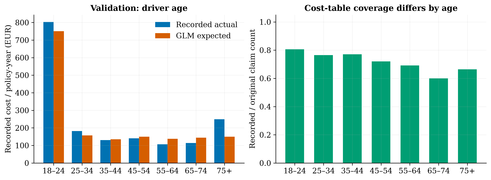
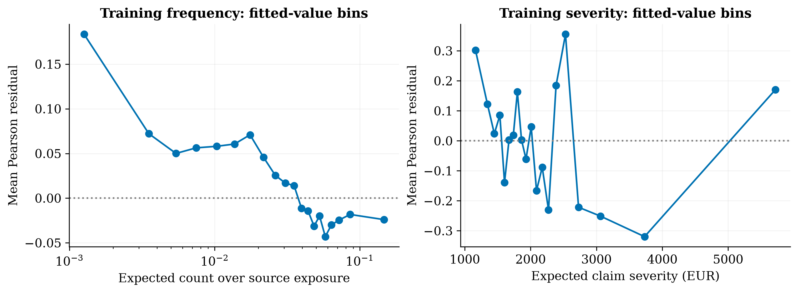
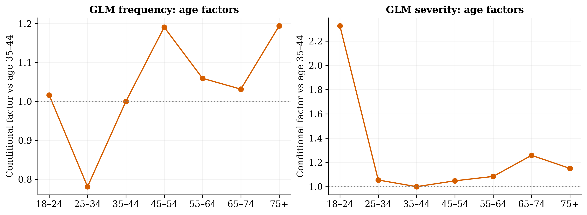

# GLM baseline — Part 2

**Recommendation:** retain this GLM as the interpretable recorded-cost benchmark and proceed to the boosting comparison. Do not use these estimates for live repricing: missing costs, tail volatility and commercial assumptions remain unresolved.

All figures below are on the frozen validation population, not the final test. No validation calibration multiplier has been applied. Actual/expected (A/E) below 1 indicates predicted cost/count above observed; above 1 indicates the reverse.

## Validation against an intercept-only benchmark

| Measure | Intercept benchmark | GLM |
|---|---:|---:|
| Poisson deviance / exposure (lower better) | 0.4743 | 0.4548 |
| Gamma deviance / claim (lower better) | 1.7756 | 1.7445 |
| Tweedie p=1.5 deviance / exposure (lower better) | 87.0471 | 81.2033 |
| Frequency A/E | 0.9860 | 0.9824 |
| Severity A/E | 0.9662 | 1.0290 |
| Pure-premium A/E | 0.9527 | 0.9961 |
| Predicted recorded cost / policy-year (EUR) | 174.1534 | 166.5646 |

Recorded actual cost / policy-year is EUR 165.91. The benchmark frequency and severity are estimated on train, not validation. GLM pure-premium deviance is 6.7% lower than the intercept benchmark; this is a validation fit improvement, not a profit or retention estimate.

## Calibration uncertainty

Fixed-prediction policy bootstrap, 250 replicates, percentile 95% intervals. This measures validation sampling variability only; it does not cover parameter uncertainty, unrecorded claims or future drift.

| GLM metric | A/E | Lower 95% | Upper 95% |
|---|---:|---:|---:|
| frequency_AE | 0.982 | 0.954 | 1.006 |
| pure_premium_AE | 0.996 | 0.806 | 1.233 |
| severity_AE | 1.029 | 0.836 | 1.292 |

## Sensitivity to claim definition and large losses

| Scenario on all validation policies | Predicted EUR / year | Raw recorded-cost A/E |
|---|---:|---:|
| intercept | 174.15 | 0.953 |
| glm_main | 166.56 | 0.996 |
| source_count_illustrative | 229.66 | 0.722 |
| complete_subset_selected | 168.56 | 0.984 |
| train_p99_capped_severity | 117.65 | 1.410 |

The original-count sensitivity increases expected annual recorded-cost premium by 37.9% versus the main fit. This illustrates the importance of the unresolved claim-definition gap rather than establishing a required rate increase.

The capped sensitivity uses the training 99th percentile, EUR 16792.95. Winsorisation reduces training claim cost by 32.8%; it is an alternative capped estimand, not a corrected full-cost premium. Every validation comparison above still uses uncapped actual costs.

The source-count product assumes missing-cost claims have the modelled recorded-claim severity. That assumption is unverified; it is not an estimate of recovered ultimate loss. The complete-count subset conditions on outcomes and may select a different risk population. See the separate matched-population rows in `validation_sensitivities.csv`.

Aggregate calibration hides segment differences: the 75+ age group has a notably higher recorded-cost A/E, while 55–74 is lower. These are investigation flags, not instructions to change rates by those percentages. Claim-count coverage differs by age and large losses can dominate segment results. The `<100 claims` flag in the segment CSV is a simple volume screen, not a formal credibility test; Part 3 must add uncertainty to the comparison.

## Fit and diagnostics

All six fits converged with an unpenalised log link. The design contains 58 parameters including intercept. Main training Pearson dispersion is 1.77 for Poisson counts and 23.38 for Gamma severity.

Poisson dispersion is an overdispersion diagnostic, not proof of invalid mean predictions. Gamma dispersion is particularly influenced by extreme claims. Standard Poisson variance assumptions should not be used uncritically for uncertainty. Leverage and a dispersion-scaled Cook-like proxy identify observations worth review; they are approximate one-step diagnostics, not exact leave-one-out effects.

Frequency residuals vary across fitted observed-period count bins, including short exposures. This warrants investigation of exposure-related source effects and mean-model adequacy; it does not justify adding realised retrospective exposure as a rating predictor. Severity residual variation also warrants the large-loss sensitivity and a more flexible challenger.

Category reference levels and conditional factor estimates are in `coefficients.csv`. No coefficient confidence bounds or causal interpretation are asserted. Continuous effects use +10 bonus/malus points and +1 log(1+density) as their reported increments. Rare severity segments may have unstable estimates even when convergence succeeds.

## Implementation and reproducibility

Run `insurance-pricing train-glm` after preparation. Category encoding learns from training policies only, uses named reference levels and rejects unknown categories. Frequency fits annual rate with exposure weights, equivalent to the unpenalised count likelihood with a log-exposure offset; severity fits individual positive claims without exposure weights. No rating outcomes, IDs or exposure enter the feature design.

Models and row-level predictions/residuals are local under `artifacts/glm/`; aggregate reports and vector/raster figures are committed. Metadata records source/config/processed-data/code hashes, package versions, iterations and model checksum.

The final test partition has not been scored in Part 2. Part 3 must freeze the comparison before test evaluation, and report Gini/lift with policy-level uncertainty and model trade-offs. No dashboard, true historical loss ratio, elasticity estimate or commercial profit result exists yet.
